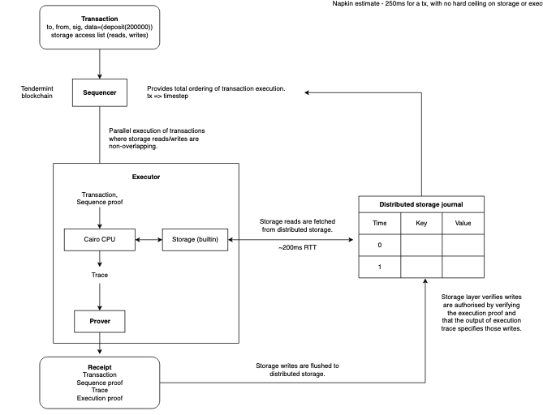

quark
=====

*quark - quick STARK!*

A decentralized horizontally-scaled state machine that can transfer 1,000,000 unique tokens on Uniswap in a single atomic transaction. How?

 * **UXTO-like storage**. Transactions only lock the parts of state they modify, there is no global state lock like in EVM.
 * ...**distributed**. Instead of every node storing the entire state, we partition the data in the same way Google's Bigtable/Spanner scales to trillions of rows. 
 * ...**decoupled from execution**. STARK proofs are the answer - self-contained transactions that prove the storage leaves they updated, in `O(log N)` time. 

This is a **completely new L1 architecture** that scales better than Rollups and Solana, and doesn't compromise on decentralization.

## Design.

The blockchain state machine is decoupled into sequencing, execution, and storage layers.

Storage nodes store the persistent state of the blockchain. Storage is modeled as a sorted multidimensional map, where the key is `(contract, storage_key)`, the dimensions are `(value, time)`, and the data is partitioned according to row range.

Execution nodes use the storage network for their memory:

 1. **Reads**. Every transaction declares the storage leaves it reads from ahead-of-time, and these are fetched in parallel from the storage network at the beginning of tx execution. 
 2. **Writes**. The execution node generates a STARK proof of a transaction's state transition. This is used to prove the storage writes are authorised to the storage nodes. 

Transactions are scheduled in parallel. In order to maintain a consistent view of the machine's memory, the sequencer provides the total ordering of transactions to both the execution and storage layers.

The memory model is best described as [multiversion concurrency control](https://en.wikipedia.org/wiki/Multiversion_concurrency_control), as there are no global locks. Like Bitcoin and Solana, transactions can be scheduled in parallel if they don't modify the same state. **Unlike Bitcoin and Solana**, the cost of verifying transactions is **vastly cheaper** - atop [Cairo proofs](https://twitter.com/liamzebedee/status/1516249413089636352), tx verification scales sublinearly in number of VM steps - `O(log^2 n)`.

Storage is partitioned according to row range, which makes it cheap to fetch large numbers of storage slots from a single contract, as this only touches at most a few nodes. 



More information in this [system model](https://viewer.diagrams.net/?tags=%7B%7D&highlight=0000ff&edit=_blank&layers=1&nav=1&title=Quark%20blockchain%20design#Uhttps%3A%2F%2Fdrive.google.com%2Fuc%3Fid%3D16K6Q2XHc31jMMdpi9XnMd2XxzX9BPKtQ%26export%3Ddownload).

## Proof of Concept.

 * Sequencer - Tendermint blockchain built with [Lotion](https://lotionjs.com/).
 * Executor - 
   * Built atop Starkware's [Cairo](https://www.cairo-lang.org/).
   * Simple PoC of transactional memory. We run a program which accepts storage leaf inputs, performs some computation, and outputs the storage leaves written.
   * Generates proofs and sends them to the storage layer
 * Storage - 
   * Accepts execution receipts from executor, verifies the proofs, flushes the state.
   * Stores data in SQLite.

Progress:

 - [x] Implement sequencer
 - [x] Implement executer proof-of-concept
 - [x] Implement storage backend
 - [x] Setup simple e2e communications between all three
 - [ ] Open-source Cairo prover
   - [x] [CLI to generate proofs](https://github.com/maxgillett/giza/pull/1)
   - [x] Reverse-engineer Cairo runner outputs
   - [ ] Parse cairo-runner output into winterfell structs
   - [ ] implement cairo prime field
 - [ ] generate proofs and verify them on the storage node
 - [ ] test networking speed.
 - [ ] simple web UI for realtime storage updates

### Install.

```
# Setup Python virtual env.
python3.7 -m venv ~/cairo_venv
source ~/cairo_venv/bin/activate

# Install this forked version of the cairo toolchain
# https://github.com/liamzebedee/cairo-lang
# pip3 install cairo-lang
```

## Napkin calculations.

```
(1) 
Sequencer determines global ordering of txs. Users post txs to the sequencer, which enqueues them. 
[tendermint 400tps = 2.5ms)

(2) 
Executor generates a trace of the state transition. If we can declaratively declare data dependencies, this can be parallelised. Executor writes to the distributed storage journal (a bigtable db).
Assuming good data locality, parallel trace generation.

[100ms to fetch state in parallel from any number of storage nodes]
[10ms to execute transaction in VM]
[0.1ms to generate proof (ImmutableX's 10K tps implies this)]
[100ms to flush writes to storage journal]
O(log^2 n) to verify proofs on distributed storage nodes.

Napkin estimate - 250ms for a tx, with no hard ceiling on storage or execution steps.
```

Storing state for a popular ERC20 like USDC -

```
(u256 address, u256 balance)
row size = 64 bytes
1B rows = 64 GB of state
target partition size = 200MB
num partitions = 320
maximum rows per partition = 200MB/64bytes = 3,125,000 rows
```